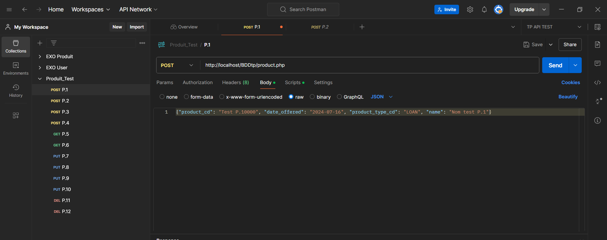
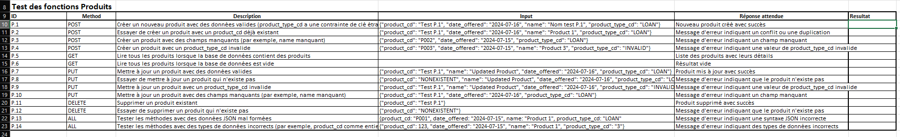
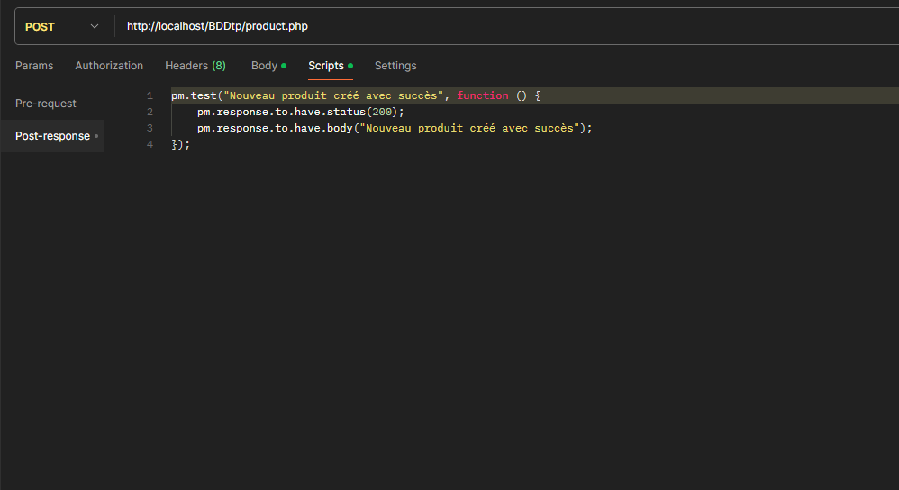

# Test d'une API et Rédaction de Cas de Test

## Introduction

Ce travail pratique a pour objectif de découvrir, tester et documenter une API, tout en développant un plan de test et des cas de test. L'objectif final est d'automatiser ces tests dans Postman, garantissant ainsi la qualité et la fiabilité des opérations de l'API.

### Outils Utilisés
- **Postman** : Pour l'exécution et l'automatisation des tests.
- **DBeaver** : Pour la gestion de la base de données SQL.
- **Documentation de l'API** : Pour une compréhension approfondie des endpoints disponibles.

### API `product.php`
L'API exploitée dans ce projet permet d'interagir avec une base de données SQL qui liste des produits bancaires. Cette base de données a été installée sur un serveur local, facilitant ainsi un accès rapide et efficace aux données.

## Déroulé du TP

### **1. Test Exploratoire/Fonctionnel**
Nous avons d'abord exécuté les différentes requêtes à l'aide de Postman pour comprendre le fonctionnement de l'API. Grâce à une documentation complète, nous avons pu explorer les méthodes GET, POST, PUT et DELETE, permettant une compréhension approfondie des opérations possibles.

### **2. Rédaction des Cas de Test et Plan de Test**
Les succès et les échecs rencontrés lors de la phase exploratoire ont permis d'identifier les cas de test à mettre en place pour couvrir toutes les méthodes de l'API. Ces cas de test garantissent une validation exhaustive de chaque fonctionnalité.

### **3. Automatisation des Tests**
Une fois les tests effectués et enregistrés dans Postman, la dernière étape consiste en l'automatisation. Nous avons intégré des scripts JavaScript pour valider les réponses renvoyées par le serveur, assurant ainsi une exécution fiable de nos tests et une qualité constante des services proposés par l'API.

